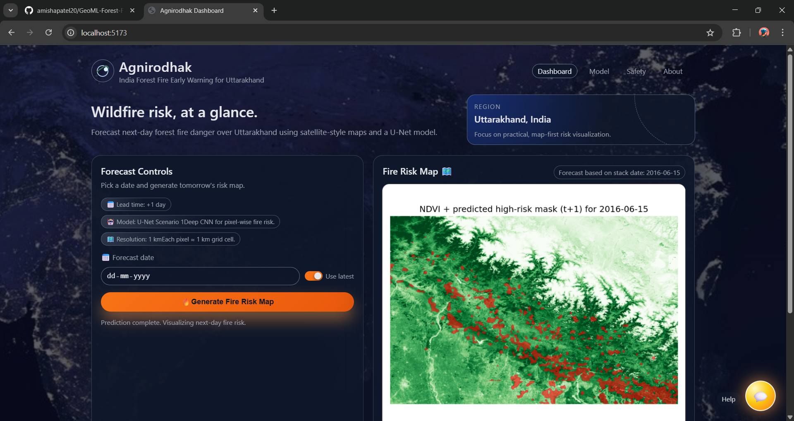
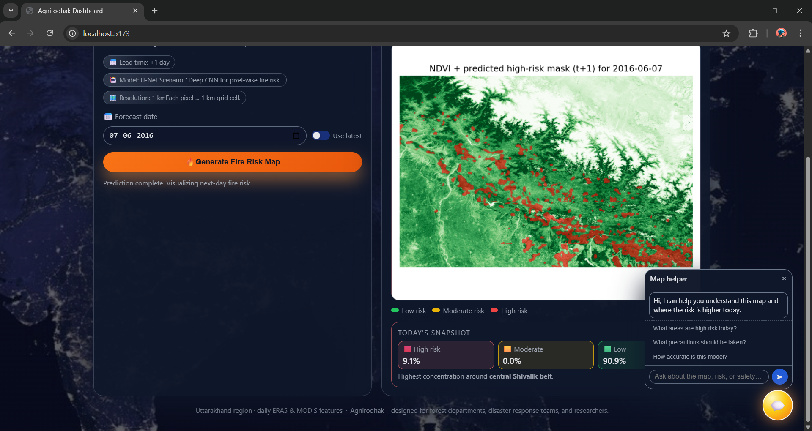

# Agnirodhak – Forest Fire Early Warning for Uttarakhand

Agnirodhak is a forest‑fire early‑warning dashboard for Uttarakhand.
It combines a U‑Net segmentation model (next‑day burn probability) with a
FastAPI backend and a modern web UI so that scientists, administrators,
and citizens can explore where fire risk is higher on a given day.






The project is intended as a **full‑stack portfolio piece**: it
demonstrates geospatial ML, clean API design, and a production‑style
dashboard rather than a raw notebook demo.

---

## 🔗 Live Demo

- https://geoml-forest-fire-predictor-agnirhodhak-2.onrender.com


---

## 🌟 What the App Delivers

- **Next‑day risk map** for Uttarakhand based on daily stacks of
  temperature, wind, NDVI, topography, and land cover.
- **Pixel‑level probability map** from a Keras/TensorFlow U‑Net
  (Scenario 1: t → t+1) with a tuned decision threshold.
- **Three‑level risk breakdown** (High / Moderate / Low) computed
  from the predicted probabilities and exposed in the API.
- **Focus region summary** (e.g., Garhwal / Kumaon / Terai‑like
  patterns) derived from the spatial distribution of high‑risk pixels.
- **Precautions & response guidance** view with:
  - Risk banner (Normal / Caution / High alert) and a preparedness score.
  - Do / Don’t guidance if you live near forests.
  - Simple recommendations for what to do if you see smoke or fire.
- **Emergency contact hints** for key Uttarakhand districts and a
  small **“check an area” helper** that ties the map focus and
  helpline info together in plain language.
- **Assistant panel** that answers common questions about how to
  read the map and what the colours mean.

---

## 🏗️ Architecture

- **Backend – FastAPI** (`webapp/main.py`)
  - Loads the saved U‑Net model and metadata (threshold).
  - Reads daily stacked GeoTIFFs from `daily_stacks/`.
  - Runs tiled inference on CPU/GPU and saves PNG outputs under
    `future_forecasts/`.
  - Exposes two primary endpoints:
    - `GET /api/available-dates` – list of dates for which stacks exist.
    - `GET /api/predict?date=YYYY-MM-DD|latest` – runs U‑Net,
      saves PNGs, and returns:
      - `probability_png` and `overlay_png` URLs.
      - `high_risk_fraction`, `moderate_risk_fraction`, `low_risk_fraction`.
      - `high_risk_focus` text summary.
  - Serves static assets (legacy minimal UI and PNGs) via `/static`
    and `/forecasts`.

- **Frontend – React (Vite)** (`frontend/`)
  - Single‑page dashboard that calls the FastAPI API.
  - Tabs for **Dashboard**, **Model details**, **Precautions & response**, and **About**.
  - NASA/ISRO‑style UI with:
    - Date selection and “Use latest” toggle.
    - Call‑to‑action: “Generate fire risk map”.
    - Map card with skeleton state, a clear loading state while the
      U‑Net runs, and a smooth fade‑in when the map is ready.
    - Legend and summary cards for High / Moderate / Low risk with
      percentages sourced from the backend fractions.
    - A small floating “Help” button that opens the assistant.

- **Research notebook – model training** (`Model.ipynb`)
  - Google Earth Engine → daily export of multi‑band stacks.
  - Baseline tabular models (HistGradientBoosting, Random Forest).
  - U‑Net training, evaluation, and export of weights + meta JSON.

---

## 📁 Repository Layout (high‑level)

```text
Agnirodhak_D/
  Model.ipynb                  # Main ML & data pipeline notebook
  ForestFire_Detector_Model.py # Scripted RF / GIF utilities (legacy)
  webapp/                      # FastAPI backend + static assets
    main.py
    static/
      index.html               # Minimal dashboard (legacy)
      style.css, app.js        # Static UI (kept as a fallback)
  frontend/                    # React (Vite) SPA dashboard
    src/App.jsx                # Main UI + tabs + assistant
  daily_stacks/                # Stacked daily GeoTIFFs (Uttarakhand_stack_YYYY-MM-DD.tif)
  future_forecasts/            # Generated PNGs from API calls
  models/                      # Saved U‑Net model + meta JSON
  figures/                     # Optional static figures / GIFs
  requirements.txt             # Python dependencies
  README.md                    # This document
```

---

## 🔌 Running the Backend API (FastAPI)

From the project root (`Agnirodhak_D/`) on Windows PowerShell:

```powershell
python -m venv venv
./venv/Scripts/Activate.ps1
pip install -r requirements.txt

# Start the FastAPI app (serves API + legacy static pages)
python .\webapp\main.py
```

The default server runs on:

- Backend base URL: http://127.0.0.1:8000
- API endpoints:
  - http://127.0.0.1:8000/api/available-dates
  - http://127.0.0.1:8000/api/predict?date=latest

The API expects stacks under `daily_stacks/` named
`Uttarakhand_stack_YYYY-MM-DD.tif`. Use `Model.ipynb` to export
additional dates before serving predictions for them.

The minimal FastAPI‑served UI is still available at:

- Dashboard (legacy): http://127.0.0.1:8000/

---

## 💻 Running the React Dashboard

The React app lives under `frontend/` and talks to the FastAPI API via
an environment variable `VITE_API_BASE`.

1. Start the backend as described above (port 8000).
2. In a new terminal:

```bash
cd frontend
npm install

# Option 1: set API base inline for local dev
VITE_API_BASE=http://127.0.0.1:8000 npm run dev

# Option 2 (Windows PowerShell):
$env:VITE_API_BASE = "http://127.0.0.1:8000"; npm run dev
```

3. Open the Vite dev URL shown in the terminal (usually
   http://127.0.0.1:5173).

When deployed (e.g. on Render), set `VITE_API_BASE` to the
public URL of the FastAPI service so the frontend uses the hosted API.

---

## 📊 Modeling & Data (short overview)

The heavy research / experimentation lives in `Model.ipynb`. At a
high level:

- **Data sources (Google Earth Engine)**
  - ERA5 Daily reanalysis: temperature and winds (10 m).
  - MODIS NDVI and burned area.
  - ESA WorldCover land cover.
  - SRTM DEM and terrain derivatives (slope, aspect, hillshade).

- **Feature design**
  - Daily dynamic features: TempC, U10, V10, WindSpeed, NDVI.
  - Static context: LULC, DEM, Slope, Aspect, Hillshade.
  - Current burn mask to avoid predicting new ignition on already
    burned pixels.
  - Lagged windows and (optionally) day‑to‑day differences.

- **Targets**
  - ANY_BURN: any pixel that will be (or remain) burned the next day.
  - NEW_IGNITION: pixels newly burned at t+1.

- **Models**
  - HistGradientBoosting and Random Forest baselines on tabular
    features.
  - U‑Net convolutional model (Scenario 1, used in the web app).
  - A ConvLSTM sequence model for experiments with temporal stacks.

- **Best‑threshold metrics comparison (higher is better)**

  | Model                          | G‑mean  | CBA     | Precision | Accuracy |
  |--------------------------------|---------|---------|-----------|----------|
  | U‑Net Scenario 1 (t → t+1)     | 0.9391  | 0.7166  | 0.5015    | 0.9327   |
  | U‑Net Scenario 3 (t+1..t+5)    | 0.9287  | 0.6797  | 0.4418    | 0.9191   |
  | U‑Net Scenario 2 (t+1..t+2)    | 0.9178  | 0.6602  | 0.4204    | 0.9027   |
  | RF ANY_BURN                    | 0.8824  | 0.7325  | 0.6104    | 0.8659   |
  | ConvLSTM (5‑day seq, t → t+1)  | 0.8350  | 0.5326  | 0.2448    | 0.8223   |

The notebook also demonstrates class‑imbalance handling, threshold
selection from precision–recall curves, and GIF/MP4 visualizations of
fire‑spread risk.

---

## 🔍 Why This Project is Interesting

- Mixes **geospatial ML** (remote sensing + reanalysis) with
  **production‑style backend** (FastAPI, tiled U‑Net inference).
- Provides a **modern dashboard UI** (React + API‑driven design)
  instead of a static plot dump.
- Includes **safety / UX considerations**: clear risk language,
  emergency hints, and an assistant to help non‑experts read the map.

For research or SDE/ML internship applications, you can point to both
the modeling notebook and the deployed backend to showcase
end‑to‑end skills.


---

## 👩‍💻 Author & Maintainer

**Amisha Patel**  
Int.Msc Mathematics | AI / GeoML Research  
NIT Rourkela, India  

GitHub: https://github.com/amishapatel20
